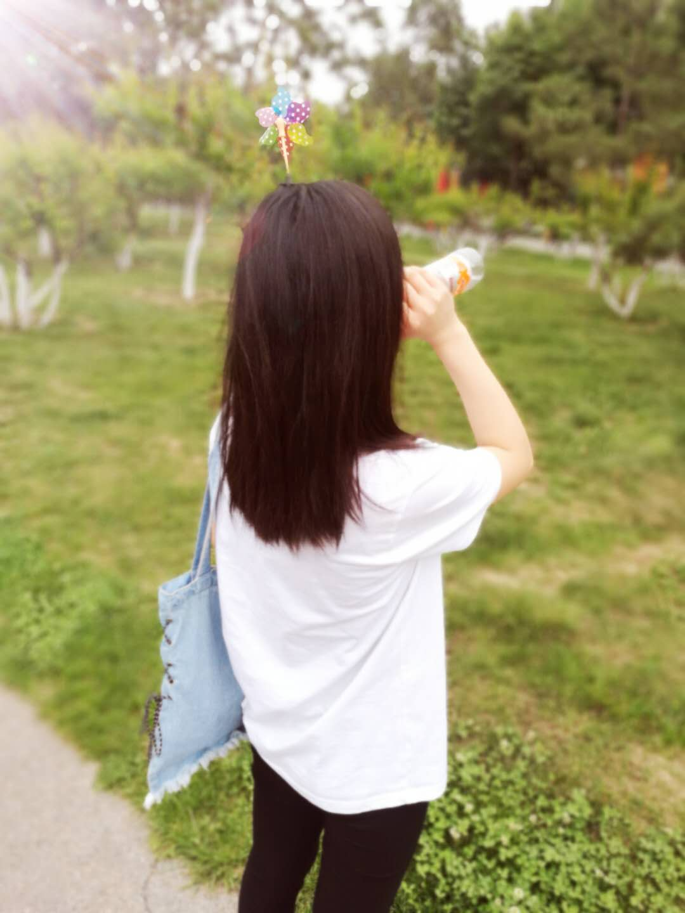
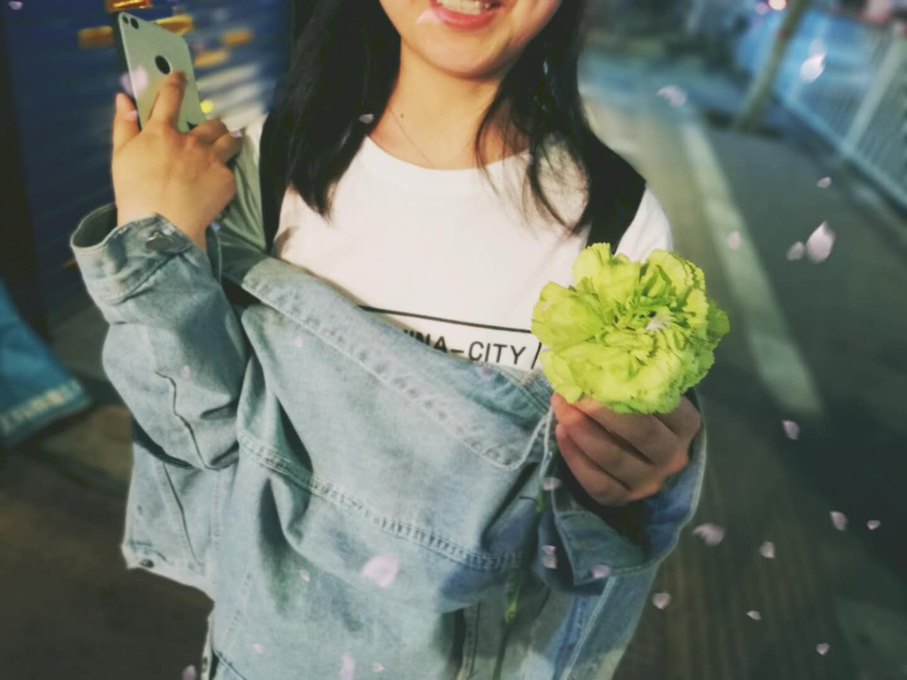

title: "7.2--无题"
date: 2015-03-01 18:00:00 +0800
update: 2018-07-02 21:00:00 +0800
author: me
cover: "-/images/example.png"
tags:
    - life
    - love
preview: 纸小墨（InkPaper）是一个GO语言编写的开源静态博客构建工具，可以快速搭建博客网站。它无依赖跨平台，配置简单构建快速，注重简洁易用与更优雅的排版。

---

现在是傍晚的7:47，刚吃完饭的我坐在工位上，得知你要去腾讯的消息，有点晃神。

《大鱼》里的歌词: “怕你飞远去，怕你离我而去...”深深触动心弦。

你说有点犹豫，可我一句挽留的话都说不口，我没有立场要求你留在我身边，可心里多么希望你可以一直在身边。

你有自己想去的远方，有自己的理想，我无论如何都应该支持你，只是我能力不足，不能随你一起。

我曾无数次幻想，自己是一个特别有能力的人，可以一直陪着你，给你想要的一切，不用考虑周遭的其他，没有多余的烦恼，我心里只有你，你心里也只有我，如此，甚好。

终究我们还是要面对现实，其实平淡的生活也很好，至少我们都年轻并健康着，我们有自己的工作，也有自己的小追求去努力着，来北京生活的这一个月零四天，我每一天都非常幸福。我们没有烦恼，也没有争吵，每个周末来临的时候，我都感叹时间的流逝如此之快。你说，有时候坐在工位上就觉得是一种幸福，其实我也觉着这样，只不过多半是因为你就在我方圆几里，我们做着类似的工作，所以我很安心，并且我一下班就可以见到你。

你入职滴滴第一周周末去团建的时候，傍晚我想骑车去接你，我担心太晚你一个人回来不安全。打开网易云音乐，刚好薛之谦的新歌发布——————《那是你离开北京的生活》，冥冥之中有种预感，只是没想到这一天终究还是来了。

幼儿时期，父母去外地工作，我寄宿在三姨家，那时候放学跑回自己家，看着空无一人的熟悉的房间。总是控制不住自己的情绪放声大哭。小时候的我的情绪就这么丰富了哈哈。

刚才听音乐的时候脑海浮现出的画面就是你离开了北京，我每天夜晚独自回到自己的出租屋，想象着平时我们嬉戏打闹的场景...

我怕孤独，怕你离我而去。两次你让我心动的瞬间我永远都记忆深刻，一次是学校大礼堂门口你拍我后背，我回头看见你挺拔的身姿和马尾辫；另一次是开学坐火车，我半夜在商丘站下车去接你，看见你迎面而来低头看路的样子。

一次是背影，一次是迎面；一次是我们刚开始认识，一次是我们刚在一起。

而后其实也有很多让我心动的时刻，比如你骑单车的时候，我每次都喜欢跟在你后面骑，其实只不过是想偷偷欣赏罢了；比如你梳妆的时候，比如你熟睡的时候...

或许，此刻的你看到这些文字，也会想念我吧。

我知道这个选择对于你来说也很艰难，我知道你会舍不得我，我更舍不得你。
但无论怎样，你的选择都不会错，我会一直支持你。

爱你，祝好。

